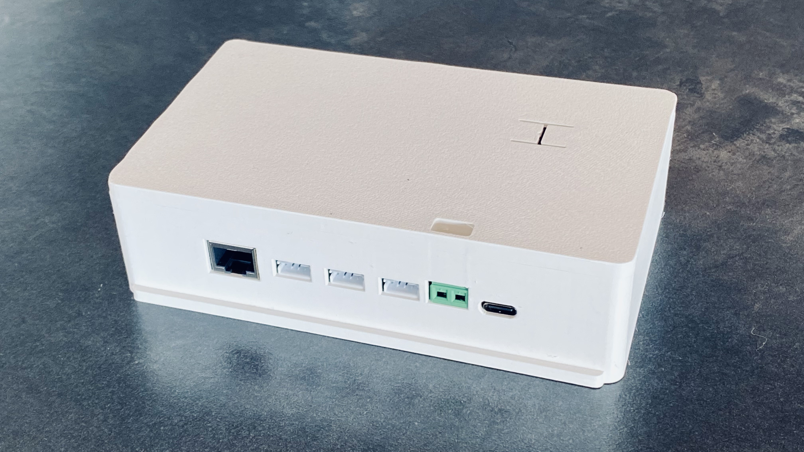

# OpenBattery Hub


OpenBattery Hub is a DIY-friendly, open-hardware ESP32-S3 IoT platform built
to work seamlessly with the open-source [OpenDTU-OnBattery](https://github.com/hoylabs/OpenDTU-OnBattery)
Project. It makes it easy to connect and monitor batteries, solar charge
controllers, and inverters — all in one compact device. Whether you're
building your own off-grid setup or just love tinkering with energy tech,
the Hub is designed to keep things simple, open, and fun to experiment with.

Built as an extensible, robust hardware platform for a variety of solar battery
systems, it aims to give developers and technicians a solid foundation
for building and adapting their own energy management solutions, behind
a single standardized interface for a range of different battery systems.

| Function | Specification |
|---|---|
| MCU | ESP32-S3 16MB |
| CAN Bus / RS-485 Interfaces | SN65HVD230DR / ISL3178EIBZ-T |
| VE.Direct Interfaces | 3x isolated, 4-PIN JST PH |
| Power & Programming | USB-C, onboard 5V-to-3.3V regulator, max. 1A |
| Dual Inverter Interface | Nordic NRF24L01+ (HM) / EByte CMT2300A (HMS/T) |

## What you can do with it

- Unlock the full potential of OpenDTU-OnBattery — all features fully supported
- Connect and control Hoymiles HM, HMS, and HMT inverters
- Connect and monitor up to 3 Victron MPPTs or 2 MPPTs and 1 Smartshunt
- Interface with popular batteries like Pylontech (CAN bus), JK-BMS, and Victron SmartShunt
- Optionally add a compact OLED display for real-time stats right on the device

A [detailed PCB view](docs/screenshot/2D_PCB%201.9.3_2026-07-22.png) (top-down, labeled layout) is also available.

## Enclosure

A 3D-printable case is included (see [`hardware/case`](hardware/case)).

<p>
  
  
</p>

## Status

- Hardware revision: **1.9.3**
- Field-tested with approx. 50 units

## Getting started

This board is bare hardware — by itself it does nothing. Everything it
does (talking to your inverters, batteries, and charge controllers, and
serving the web interface) comes from the **firmware**, which is a
separate open-source project: [**OpenDTU-OnBattery**](https://github.com/hoylabs/OpenDTU-OnBattery).
It is not included in this repository (see [License](#license) below)
and is not preinstalled — you flash it onto the board yourself before
first use.

1. **Flash the firmware.** Connect the board to your computer via
   USB-C and flash OpenDTU-OnBattery onto it. Instructions are in the
   [OpenDTU-OnBattery documentation](https://opendtu-onbattery.net/);
   the project also explains what OpenDTU-OnBattery is and how it
   works in general, independent of this specific board.
2. **Power it up.** Plug a 5V / 2A USB-C power supply into the board's
   USB-C port.
3. **Connect to its Wi-Fi hotspot.** After booting, the board creates
   its own Wi-Fi network named `OpenDTU-xxxxxx`. Connect to it with the
   default password `OpenDTU42`.
4. **Open the web interface.** With a browser, go to `192.168.4.1` and
   follow the on-screen setup. Be sure to pick the configuration
   profile that matches your hardware setup (which battery type, how
   many MPPTs, etc.) — the manual linked below lists the profile for
   each supported setup.
5. **Wire up your solar gear.** Connect your batteries, MPPT charge
   controllers, and/or inverter to the board's ports according to the
   profile you selected.

Full specifications, port pinouts, and wiring diagrams for common setups
(Pylontech CAN, JK-BMS RS485, Victron SmartShunt, multi-MPPT), plus the
optional OLED/serial header pinout, are documented in
[`docs/Openbattery Hub - Datasheet & Manual.pdf`](docs/Openbattery%20Hub%20-%20Datasheet%20%26%20Manual.pdf).

## Repository layout

```
hardware/
  schematics/   schematic exports (PDF)
  pcb/          PCB layout exports (PDF/PNG)
  bom/          Bill of Materials
  fabrication/  Pick-and-Place data and other assembly files
  gerber/       Gerber/drill files for fabrication
  case/         3D-printable enclosure files
  source/       editable EasyEDA/Altium source files (Complete Source, see hardware/source/README.md)
docs/           datasheet/manual, photos, additional documentation
```

## License

The hardware design files in this repository are licensed under the
**CERN Open Hardware Licence Version 2 - Strongly Reciprocal (CERN-OHL-S v2)**.

See [LICENSE](LICENSE) for the full licence text and [NOTICE.md](NOTICE.md)
for the required notice, source location, and scope (including what is
*not* covered — e.g. firmware and the project name/logo).

Firmware is **not** part of this repository. This board is designed to run
[OpenDTU-OnBattery](https://github.com/hoylabs/OpenDTU-OnBattery), an
independent open-source project licensed under GPL-3.0.

## Disclaimer

This is an open-source, hobbyist-grade hardware project, provided **"as
is"**, without warranty of any kind, express or implied — including, but
not limited to, fitness for a particular purpose or merchantability (see
[LICENSE](LICENSE) section 6, "Disclaimer and Liability", for the full
disclaimer of warranty and limitation of liability that governs the
design files).

This board is intended to be wired into battery and solar/PV systems,
which involve real electrical, fire, and chemical hazards (e.g. Li-ion
battery packs, DC bus voltages). Building, modifying, and operating it is
entirely **at your own risk**. The author(s) and contributors accept
**no liability** for any damage, injury, data loss, or other harm arising
from the use, misuse, or malfunction of this design, whether built from
the files in this repository or from boards manufactured elsewhere.

- This is not a certified or listed product (no CE/UL/etc. certification is claimed).
- Verify all wiring against your specific battery/inverter/charge-controller documentation before connecting anything.
- Have any mains or high-voltage work done or checked by a qualified electrician; follow the safety instructions and local regulations that apply to your battery and PV equipment.
- If you're not comfortable assessing these risks yourself, don't build or operate this board.
